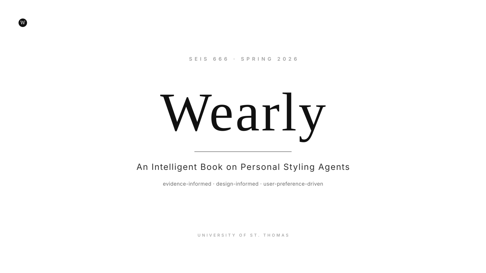

  

# Wearly — Intelligent Book

> *Your style, reasoned.*

Welcome to the **Wearly Intelligent Book** — the companion documentation for the [Wearly styling-agent prototype](https://github.com/eatedalsf/styling-agent).

Wearly is a **mobile-first, evidence-informed personal styling agent**. It recommends complete outfits using your calendar, real-time weather, wardrobe, color profile, and wear history — and it explains every decision in a numbered reasoning trail.

This book documents *why* the agent is the way it is. The source code, the rule packs, the knowledge graph, the architecture, and the evidence categories all live alongside each other in a single repository — and they're presented here in one navigable site.

!!! info "About the data shown in this book and the live demo"
    Every example in this book — outfit recommendations, profile fields,
    wardrobe items, calendar events — uses **demo data**, not real
    personal data. The seed `wardrobe.json` belongs to a fictional
    "Demo User." Per-user files written by the running app
    (`user_wardrobe.json`, `user_profile.json`, `wishlist.json`,
    `favorite_stores.json`, `routine.json`, `wear_history.json`) are
    `.gitignore`d and never published. Each developer who runs the app
    keeps their own local overlay.

---

## 🚀 Try the live app

The hosted prototype is at **[styling-agent.streamlit.app](https://styling-agent-64jigzmqms4v7f9ugou8bv.streamlit.app/)** — no install, no signup. Open it in any browser, mobile or desktop.

The repository itself: **[github.com/eatedalsf/styling-agent](https://github.com/eatedalsf/styling-agent)**.

---

## 📖 What's in the book

| Section | What you'll find |
|---|---|
| **[The Book](book/index.md)** | Three parts: Part I — twelve chapters explaining the Wearly agent (vision, user problem, seven-step workflow, knowledge base, wardrobe intelligence, fit-profile logic, calendar/weather context, shopping-gap logic, before/after, privacy, roadmap). Part II — eight Styling Rule Reference chapters teaching color, silhouette, occasion, weather/layering, wardrobe construction, freshness, honest gaps, and body-positive framing. Part III — evidence & provenance. |
| **[Glossary](docs/glossary.md)** + **[FAQ](docs/faq.md)** + **[References](docs/references.md)** | A project-wide glossary, a top-questions FAQ, and a numbered bibliography of every verified source the rules trace back to. |
| **[Audit](docs/audit-2026-05.md)** | A consistency audit between the app and the book — every contract (numbers, vocabulary, rules) cross-checked. |
| **[Evidence](docs/evidence-and-references.md)** | The canonical references document. Nine source categories every rule pack draws on, with verification status. |
| **[Skills](skills/wearly-styling-agent/SKILL.md)** | The Wearly Styling Agent skill package — `SKILL.md` plus eight rule packs (occasion, weather, fit & silhouette, wardrobe filtering, color coordination, wear history, shopping gap, privacy). Every rule pack ends with a *Source basis* footer. |
| **[Wearly Knowledge Graph](docs/sims/wearly-knowledge-graph/index.md)** | The three-layer structured-knowledge graph — domain, user behavior, runtime archetypes. 91 nodes, 187 typed edges. Click any node for details; double-click to highlight its 1-hop neighborhood. |
| **[MicroSims](docs/sims/index.md)** | Interactive simulations: color harmony, wear-history freshness. Each one lets you try a rule by hand. |
| **[Architecture](docs/architecture.md)** | System-level snapshot — code layout, tool boundaries, data files, dependencies. |
| **[Project Vision](Wearly_Product_Brief.md)** | The product brief and the academic / course context that frames this project. |

---

## 🧭 The honesty contract

Four rules govern everything Wearly claims:

1. **Styling is not an exact science.** Wearly says *"tends to work well,"* not *"is correct."*
2. **Body-positive language is non-negotiable.** Enforced at runtime (`fit_tool.check_reasoning_for_forbidden_language()`) and across documentation (`tests/test_documentation_integrity.py`). Forbidden root concepts: `flaw / fix / hide / minimize / correct / problem area / trouble area / slimming / shameful` (the runtime expands each into variants — see [§S8](book/S8-body-positive-framing.md) for the full enforcement list).
3. **No fabricated citations.** Categories are named when they're textbook common knowledge; specific authors, papers, and findings appear only after verification.
4. **The user is the final reviewer.** Reject-and-regenerate, the editable fit profile, and the "Wear this outfit today" confirmation all exist because no rule system can be authoritative about personal taste.

See the [evidence and references doc](docs/evidence-and-references.md) for the structured version.

---

## 🤝 Reading this site

- **Linear**: start with [chapter 01](book/01-vision.md) and read through to chapter 12.
- **By role**:
  - *Reviewer / grader*: chapter [03 (Agent workflow)](book/03-agent-workflow.md) and [09 (Before / after demo)](book/09-before-after-demo.md).
  - *Engineer*: [Architecture](docs/architecture.md) → [Skills](skills/wearly-styling-agent/SKILL.md).
  - *Designer / product*: chapter [01 (Vision)](book/01-vision.md) → [05 (Wardrobe intelligence)](book/05-wardrobe-intelligence.md) → [12 (Evidence)](book/12-evidence-and-references.md).
- **By concept**: use the **search bar** at the top of every page (it's keyword-indexed across every chapter, rule pack, and architecture doc).

---

*This site is built with [MkDocs Material](https://squidfunk.github.io/mkdocs-material/) from the Markdown files in the [styling-agent repository](https://github.com/eatedalsf/styling-agent). Every page has an **"Edit this page"** link in the top-right that opens the source file on GitHub.*
