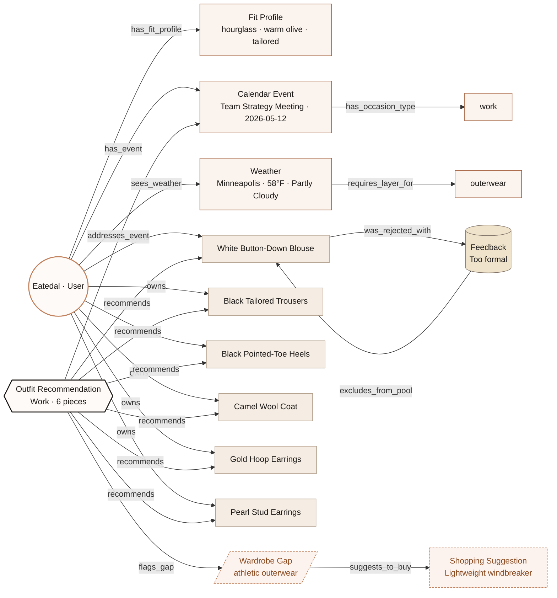

# Wearly Knowledge Graph — Visualization

This page renders the schema in `schema.md` as a Mermaid diagram. GitHub renders Mermaid natively, so opening this file on GitHub shows the diagram directly. The schema and the serialized triples live alongside (`schema.md`, `graph.json`).

> **Looking for the FAQ?** Library used, what node size means, what colors mean, why not Neo4j, structured queries, how the graph connects to the agent's reasoning — all in [`docs/knowledge-graph-faq.md`](../docs/knowledge-graph-faq.md). That page is the single source of truth for the visual legend; the same content is also embedded into the app under every interactive graph as a "What does this graph mean?" expander.

## Node-size legend (live-run graph)

Node size encodes a real signal — not just role.

| Node type | Diameter rule | Meaning |
|---|---|---|
| `User` | fixed 32 px | visual anchor |
| `OutfitRecommendation` | `22 + 2 × piece_count`, clamped 22..44 px | how many decisions this run made |
| `WardrobeItem` | `18 + 2 × worn_count`, clamped 18..30 px | how often you reach for this piece |
| Context (`CalendarEvent`, `FitProfile`, `WeatherSnapshot`) | fixed 22–26 px | context is context, not centerpiece |
| Derived (`WardrobeGap`, `ShoppingSuggestion`, `Feedback`) | fixed 18–22 px | downstream of the picks |

Hover tooltips on items state `"Worn: N times (node size encodes this)"` so the rule isn't hidden in the code.

---

## The graph at a glance

---

## How to read this

- **The User** sits on the left. Every traversal starts from there.
- **Context entities** (Fit Profile, Calendar Event, Weather) feed into the agent's reasoning.
- **Wardrobe items** are *owned* by the user. The agent picks from these.
- **The Outfit Recommendation** in the middle-right is the **product of the seven-step workflow** — it points back to the event it addresses and forward to the items it includes.
- **Wardrobe Gap → Shopping Suggestion** is the resolution path when a piece is missing.
- **Feedback → excludes_from_pool** is the reject-and-regenerate loop.

If you trace any edge from the Outfit Recommendation node, you'll arrive at the **reason** it exists.

---

## Why a graph at all

The course principle "structure beats volume" is operational here. A reviewer asking *"how does Wearly decide?"* gets one of three answers:

1. **A flowchart** (`workflow_diagram.md`) — shows the *steps*.
2. **An architecture diagram** (`docs/architecture.md`) — shows the *files*.
3. **This knowledge graph** — shows the *relationships*.

Each lens is necessary. The graph in particular makes it visible that Wearly isn't a chain of prompts — it's a model of the user's life, their day, and their closet, with explicit edges between them.
